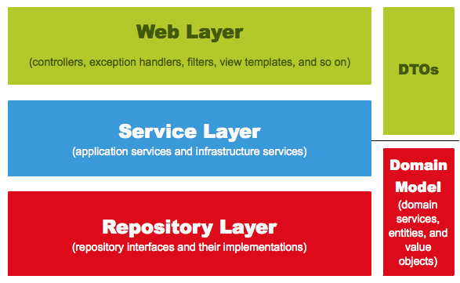
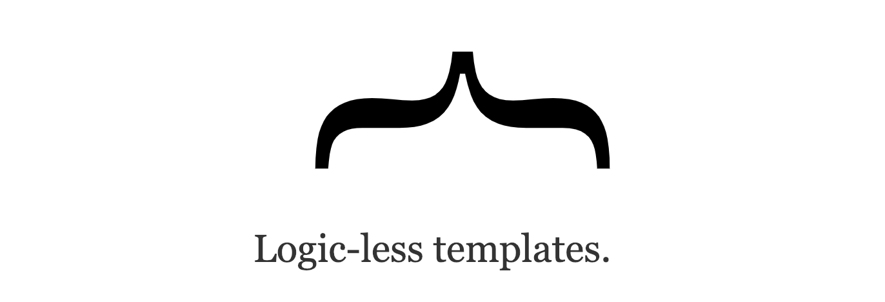
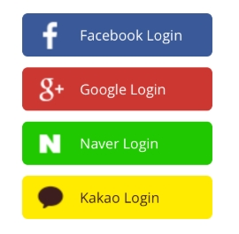

<details>
<summary> HelloControllerTest.java</summary>

``` java
package spring.java.webapp.web;

import org.junit.jupiter.api.Test;
import org.springframework.beans.factory.annotation.Autowired;
import org.springframework.boot.test.autoconfigure.web.servlet.WebMvcTest;
import org.springframework.test.context.junit4.SpringRunner;
import org.springframework.test.web.servlet.MockMvc;

@RunWith(SpringRunner.class)
@WebMvcTest(controllers = HelloController.class)
public class HelloControllerTest {

    @Autowired
    private MockMvc mvc;

    @Test
    public void hello가_리턴된다() throws Exception {
        String hello = "hello";

        mvc.perform(get("/hello")).andExpect(status().isOk()).andExpect(content().string(hello));

    }

}
```
</details>

</br>

1. @RunWith(SpirngRunner.class)
    - 테스트를 진행 할 때 JUnit에 내장된 실행자 외에 다른 실행자를 실행
    - 여기서는 SpringRunner라는 실행자를 사용
    - 스프링 부트 테스트와 JUnit 사이에 연결자 역할을 함.
2. @WebMvcTest
    - 스프링 테스트 어노테이션 중, Web(Spring MVC)에 집중할 수 있는 어노테이션
    - 선언할 경우 @Controller, @ControllerAdvice 등을 사용할 수 있음
    - 단, @Service, @Component, @Repository 등은 사용 불가능
    - 여기서는 컨트롤러만 사용하기 때문에 선언했음.
3. private MockMvc
    - 웹 API를 테스트할 때 사용
    - 스프링 MVC 테스트의 시작점
    - 이 클래스를 통해 GET,POST 등에 대한 API 테스트를 할 수 있음.
4. mvc.perform(get("/hello"))
    - MockMvc를 통해 /hello 주소로 GET 요청을 함.
    - 체이닝이 지원되어 여러 검증 기능을 이어서 선언 할 수 있음.
4.1 andExpect(status().isOk())
    - mvc.perform의 결과를 검증
    - HTTP Header의 Status를 검증
    - 200,404,500 등의 상태를 검증할 수 있음
    - 여기서는 isOK() 코드를 적었으므로 200인지 아닌지를 검증하는 것임
4.2 andExpect(content.string(hello))
    - 응답 본문의 내용을 검증
    - Controller에서 "hello"를 리턴하기 때문에 이 값이 맞는지 검증함.


</br><hr></br>

<h2> JPA 소개</h2>
</br>


웹 어플리케이션에서 관계형 데이터베이스는 빠질 수 없는 요소이다.</br>
그러다 보니 객체를 관계형 데이터 베이스에서 관리하는 것이 중요하다.</br>
개발자가 아무리 자바 클래스를 아름답게 설계해도, SQL을 통해야만 데이터베이스에 저장하고 조회할 수 있다.</br> 
결국, 관계형 데이터베이스를 사용해야만 하는 상황에서 SQL은 피할 수 없는 것이다.</br>
 상속, 1:N 등 다양한 객체 모델링을 데이터베이스로는 구현 할 수 없다.</br>그러다보니 웹 어플리케이션 개발은 점점 데이터베이스 모델링에만 집중하게되는데..</br>JPA는 이런 문제점을 해결하기 위해 등장한 기술이다.
</br>
JPA는 서로 지향하는 바가 다른 2개 영역(객체지향 언어와 관계형데이터베이스)을 중간에서 패러다임 일치를 시켜주는 역할을 한다.</br>
개발자가 객체지향적으로 프로그래밍을 하고, JPA가 이를 관계형데이터베이스에 맞게 SQL을 대신 생성해서 실행한다.</br>
JPA를 사용하면 SQL에 종속적인 개발을 하지 않아도 되는것이다.

</br>

User가 본인이 속한 Group을 가져온 코드
```java
 User user = findUser();
 Group gorup = user.getGroup();
```
</br>

위 코드에 데이터베이스가 추가되는 경우

```java
User user = userDao.findUser();
Group group = groupDao.findGroup(user.getGroupId());
``` 

</br><hr></br>

<h2> Spring Data JPA </h2>
</br>
JPA는 인터페이스로서 자바 표중명세서이다. </br>
인터페이스인 JPA를 사용하기 위해서는 Hibernate, Eclipse Link 등 구현체가 필요하다. </br>
하지만 Spring에서 JPA를 사용할 때는 이 구현체들을 직접 다루지 않고 구현체들을 좀 더 쉽게 추상화시킨 <strong>Spring Data JPA</strong> 라는 모듈을 이용하여 JPA 기술을 다룬다.
</br></br>

JPA와 Spring Data JPA의 관계
<pre>
JPA <- Hibernate <- Spring Data JPA
</pre>

Hibernate를 쓰는 것과 Spring Data JPA를 쓰는 것 사이에는 큰 차이가 없지만 그럼에도 스프링 진영에서는 Spring Data JPA를 개발했다.</br>
Spring Data JPA의 등장 이유는 크게 두가지가 있다
- 구현체 교체의 용이성
- 저장소 교체의 용이성

현재는 Hibernate를 사용하고 있지만 언젠가 Hibernate를 대체하는 구현체가 나와 교체를 해야하는 상황이 온다면 Spring Data JPA에서는 이를 아주 쉽게 교체 할 수 있도록 해놓았다.</br>
관계형 데이터베이스를 사용하다가 MongoDB 등 비관계형 데이터베이스로 교체가 필요할 때 Spring Data JPA에서 Spring Data MongoDB로 의존성만 교체하면 된다.

</br>

### JpaRepository 

</br>

`JpaRepository<Entity 클래스, PK(PrimaryKey) 타입>`을 상속하면 기본적인 CRUD 메소드가 자동으로 생성됨. `@Repository` 어노테이션을 추가할 필요도 없음 👍 </br>
🌞주의할 점 : Entity 클래스와 기본 Entity Repository는 함께 위치해야한다

```java
public interface PostsRepository extends JpaRepository<Posts,Long> {
}
```

</br>

### ⭐ JPA의 영속성 컨텍스트
- 영속성 컨텍스트란, 엔티티를 영구 저장하는 환경. 일종의 논리적 개념
- JPA의 핵심 내용은 엔티티가 영속성 컨텍스트에 포함되어 있냐 아니냐로 갈린다.
- JPA의 엔티티 매니저(EntityManager)가 활성화된 상태로 트랜잭션 안에서 데이터베이스에서 데이터를 가져오면 이 데이터는 영속성 컨텍스트가 유지된 상태이다.
- 이 상태에서 해당 데이터 값을 변경하면 트랜잭션이 끝나는 시점에 해당 테이블에 변경분을 반영한다. 즉, Entity 객체의 값만 변경하면 별도로 Update 쿼리를 날릴 필요가 없다. 이 개념을 <Strong>더티 체킹(DirtyChecking)</Strong>이라고 한다.
- 참고 링크 : <a href="https://jojoldu.tistory.com/415">더티 체킹(DirtyChecking)이란?</a>

</br>

### JPA Auditing으로 생성시간/수정시간 자동화하기
</br>
JPA Auditing 없을 때 생성일 추가 코드 예제

```java
public void savePosts(){
  posts.setCreateDate(new LocalDate());
  postsRepository.save(posts);
}
```

JPA Auditing 적용 - `BaseTimeEntity.java`</br>
모든 Entity의 상위 클래스가 되어 Entity들의 CreatedDate, modifiedDate를 자동으로 관리함.
```java
import java.time.LocalDateTime;
import javax.persistence.EntityListeners;
import javax.persistence.MappedSuperclass;
import org.springframework.data.annotation.CreatedDate;
import org.springframework.data.annotation.LastModifiedDate;
import org.springframework.data.jpa.domain.support.AuditingEntityListener;

import lombok.Getter;

@Getter
@MappedSuperclass
@EntityListeners(AuditingEntityListener.class)
public class BaseTimeEntity {

    @CreatedDate
    private LocalDateTime createdDate;

    @LastModifiedDate
    private LocalDateTime modifiedDate;

}
```

`Posts.java`클래스가 BaseTimeEntity를 상속받도록 변경.
```java
public class Posts extends BaseTimeEntity{
  ...
}
```

</br>

<hr></br>

<h3> Annotation 정리


</br>

1. `@Entity`
   - 테이블과 링크될 클래스임을 나타냄
   - 기본값으로 클래스의 CamelCase 이름을 언더스코어 네이밍(_)으로 테이블 이름을 매칭한다 ex) SalesManager.java -> sales_manager table
2. `@Id`
   - 해당 테이블의 PK(Primary Key) 필드를 나타냄
3. `@GeneratedValue`
   - PK의 생성 규칙을 나타냄
   - 스프링 부트 2.0에서는 `GenerationType.IDENTITY` 옵션을 추가해야만 `auto_increment` 됨
   - <a href = 'https://jojoldu.tistory.com/295'>블로그 참고</a>
4. `@Column`
   - 테이블의 칼럼을 나타내며 굳이 선언하지 않아도 해당 클래스의 필드는 모두 칼럼이 된다
   - 칼럼의 기본값 외에 추가로 변경이 필요한 옵션이 있으면 사용한다.
   - 문자열의 경우 VARCHAR(255)가 기본값인데, 사이즈를 500으로 늘리고 싶거나, 타입을 TEXT로 변경하고 싶은 경우에 사용한다.
5. `Lombok` Annotation</br>
   서비스 초기 구축 단계에서 테이블 설계가 빈번하게 변경되는데, 롬복의 Annotation들은 코드 변경량을 최소화시켜 준다.
    - `@NoArgsConstructor`
      - 기본 생성자 자동 추가
      - public Posts(){}와 같은 효과
    - `@RequiredArgsConstructor` (@Autowired 대신 사용)
      - final이 선언된 모든 필드를 인자값으로 하는 생성자를 생성해줌.
    - `@Getter`
      - 클래스 내 모든 필드의 Getter 메소드를 자동생성
      - ⚡Entity 클래스에서는 절대 Setter 메소드를 만들지 않는다.
    - `@Builder`
      - 해당 클래스의 빌더 패턴 클래스를 생성 ❔❓
      - 생성자 상단에 선언 시 생성자에 포함된 필드만 빌더에 포함
      - 생성자의 경우 지금 채워야 할 필드가 무엇인지 명확히 지정할 수가 없다. 하지만 `Builder`를 사용하게 되면 어느 필드에 어떤 값을 채워야할지 명확하게 인지할 수 있다.
6. `@SpringBootTest`
   - 별다른 설정 없이 사용할 경우 데이터베이스를 자동으로 실행해 줌
7. `Junit` Annotation
   - `@AfterEach`
     - 테스트가 끝날 때마다 수행되는 메소드를 지정
     - 전체 테스트를 수행할 때 테스트간 데이터 침범을 막기 위해 사용.
8. `@MappedSuperclass`
   - JPA Entity 클래스들이 BaseTimeEntity을 상속할 경우 필드들도 칼럼으로 인식하도록 함.
9. `@EntityListner`
    - BaseTimeEntity 클래스에 Auditing 기능을 포함시킴.
10. `@CreatedDate` / `@LastModifiedDate`
    - Entity가 생성/수정 될 때 시간이 자동 저장됨.
11. `@EnableJpaAuditing`
    - JPA Auditing을 활성화 해줌. 메인클래스에 추가하는듯?
12. `Enumerated(EnumType.STRING)`
    - JPA로 데이터베이스로 저장할 때 Enum 값을 어떤 형태로 저장할지를 결정한다.
    - 기본적으로는 int로 된 숫자가 저장됨.
    - 숫자로 저장되면 데이터베이스로 확인할 때 그 값이 무슨 코드를 의미하는지 알 수가 없기 때문에 문자열로 저장될 수 있도록 선언한다.
13. `SpringSecurity` Annotation
    - `@EnableWebSecurity`
      - Spring Security 설정들을 활성화시켜 준다.
    - 

</br>

생성자와 `Builder`의 차이
```java
//생성자
//a와 b의 위치를 변경해도 코드를 실행하기 전까지는 문제를 찾을 수 없음.
public Example(String a, String b){
    this.a = a;
    this.b = b;
}
//Builder
Example.builder()
    .a(a)
    .b(b)
    .build();
```

`application.properties`
```properties
# 쿼리 로그 ON
spring.jpa.show_sql = true
# 쿼리 로그를 MySQL버전으로 변경
spring.jpa.properties.hibernate.dialect=org.hibernate.dialect.MySQL5InnoDBDialect;

```

</br>

<hr></br>

<h3>⭐ Spring 웹 계층

</br>



</br>

- `Web Layer`
  - 흔히 사용하는 컨트롤러(`@Controller`)와 JSP/Freemarker 등의 뷰 템플릿 영역
  - 필터(`@Filter`), 인터셉터, 컨트롤러 어드바이스(`@ControllerAdvice`) 등 외부 요청과 응답에 대한 전반적인 영역
- `Service Layer`
  - `@Service`에 사용되는 서비스 영역
  - 일반적으로 `Controller`와 `Dao`의 중간 영역에서 사용됨.
  - `@Transaction`이 사용되어야 하는 영역이기도 하다.
- `Repository Layer`
  - Database와 같이 데이터 저장소에 접근하는 영역.
- `DTOs`
  - Dto(Data Transfer Object)는 계층 간에 데이터 교환을 위한 객체이며, DTOs는 이들의 영역을 말함.
  - 뷰 템플릿 엔진에서 사용될 객체나 Repository Layer에서 결과로 넘겨준 객체 등이 이들을 말함.
- `Domain Model`
  - 도메인이랑 불리는 개발 대상을 모든 사람이 동일한 관점에서 이해할 수 있고 공유할 수 있도록 단순화시킨 것을 도메인 모델이라 함.
  - 택시 앱이라고 하면 배차, 탑승, 요금 등이 모두 도메인이 될 수 있음.
  - `@Entity`가 사용된 영역 역시 도메인 모델이다.
  - 다만, 무조건 데이터베이스와 테이블과 관계가 있어야만 하는 것은 아님.
    - VO처럼 값 객체들도 이 영역에 해당하기 때문❓


⚡ 5가지 레이어 중에서 비즈니스 처리를 담당해야 할 곳은 `Domain` 이다.
⚡ Entity 클래스를 Request/Response 클래스로 사용해서는 안된다.
⚡ View Layer와 DB Layer의 역할 분리를 철저하게 하는 것이 좋음.

</br><hr></br>

모든 로직이 서비스 클래스 내부에서 처리되는</br>
주문취소 트랜잭션 스크립트 의사코드(pseudocode)

 ```java
@Transactional
public Order cancelOrder(int orderId){
    1) 데이터베이스로부터 주문정보 (orders), 결제정보(Billing), 배송정보(Delivery)조회
    2) 배송 취소를 해야 하는지 확인
    3) if(배송중이라면){
            배송 취소로 변경
        }
    4) 각 테이블에 취소 상태 Update
}
 ```

실제코드
 ```java
@Transactional
public Order cancelOrder(int orderId){
    //1)
    OrdersDto order = ordersDao.selectOrders(orderId);
    BillingDto billing = billingDao.selectBilling(orderId);
    //2)
    String deliveryStatus = delivery.getStatus();
    //3)
    if("IN_PROGRESS".equals(deliveryStatus)){
        delivery.setStatus("CANCEL");
        deliveryDao.update(delivery);
    }
    //4)
    order.setStatus("CANCEL");
    orderDao.update(order);

    billing.setStatus("CANCEL");
    deliveryDao.update(billing);

    return order;
}
 ```
 - 모든 로직이 서비스 클래스 내부에서 처리되다보니 서비스 계층이 무의미
 - 객체란 단순히 데이터 덩어리 역할만 하게 됨.

</br>

 도메인 모델에서 처리하는 경우

```java
@Transactional
public Order cancelOrder(int orderId){
    //1)
    Orders order = ordersRepository.findById(orderId);
    Billing billing = billingRepository.finByOrderId(orderId);
    Delivery delivery = deliveryRepository.findByOrderId(orderId);

    //2-3)
    delivery.cancel();

    //4)
    order.cancel();
    billing.cancel();

    return order;
}
```
- order, billing, delivery가 각자 본인의 취소 이벤트를 처리
- 서비스 메소드는 트랜잭션과 도메인 간의 순서만 보장해 줌

</br><hr></br>

## 머스테치(Mustache)로 화면 구성

</br>

### 템플릿 엔진이란?
지정된 템플릿 양식과 데이터가 합쳐져 HTML 문서를 출력하는 소프트웨어</br>
- 서버템플릿 엔진: JSP, FreeMarker 등</br>
- 클라이언트 템플릿 엔진: React, Vue 등</br>

서버 템플릿 엔진을 이용한 화면 생성은 서버에서 Java 코드로 문자열을 만든 뒤 이 문자열을 HTML로 변환하여 브라우저로 전달함.</br>
반면에 클라이언트 템플릿 엔진의 자바스크립트는 브라우저 위에서 작동한다. 브라우저에서 작동될 때는 서버 템플릿 엔진의 손을 벗어나 제어할 수가 없다. 서버에서는 Json 또는 Xml 형식의 데이터만 전달하고 클라이언트에서 조립한다.

</br>

### 머스테치란? (what is Mustach)

 

머스테치는 수많은 언어를 지원하는 가장 심플한 템플릿 엔진이다.</br>
Ruby,JS,Python,Java,Perl,Go 등 현존하는 대부분 언어를 지원하고 있다.</br>
그러다 보니 자바에서 사용될 때는 서버 템플릿 엔진으로, JS에서 사용될 때는 클라이언트 템플릿 엔진으로 모두 사용할 수 있다.

</br>

### 자바에서 사용하는 서버 템플릿 엔진들의 단점

- JSP, Velocity: 스프링 부트에서는 권장하지 않는 템플릿 엔진.
- Freemarker: 템플릿 엔진으로는 너무 과하게 많은 기능을 지원한다. 높은 자유도로 인해 숙련도가 낮을수록 Freemarker 안에 비즈니스 로직이 추가될 확률이 높다.
- Thymleaf: 스프링 진영에서 적극적으로 밀고 있지만 문법이 어렵다. HTML 태그에 속성으로 템플릿 기능을 사용하는 방식이 높은 허들로 느껴지는 경우가 많다. Vue를 사용해 본 경험이 있어 태그 속성 방식이 익숙하다면 Thymleaf를 선택해도 된다.

### Mustach의 장점
- 문법이 다른 템플릿 엔진보다 심플하다.
- 로직 코드를 사용할 수 없어 View의 역할과 서버의 역할이 명확하게 분리됨.
- `Mustache.js`와 `Mustache.java` 2가지가 다 있어, 하나의 문법으로 클라이언트/서버 템플릿을 모두 사용 가능하다.

</br>

### Mustache 기본 문법 

</br>

출처: <a href="https://bibi6666667.tistory.com/269">티스토리 블로그</a>

- 변수
  - `{{` , `}}` 사이에 변수명을 입력한다.
    - 문자열은 자동 HTML 이스케이프 된다.
    - 이스케이프(Escape)란 특정 문자를 HTML로 변환하는 행위.
    - 이스케이프되지 않은 문자열을 출력하려면 `{{{`, `}}}`을 사용한다.
- 복잡한 객체
  - 객체 안에 객체가 포함되어 있을 때는 점 문법(dot-syntax)을 사용한다.
    - ex) `{{company.address.country}}`

- 섹션 (반복문, 조건문)
  - 섹션은 `{{#변수명}}` 으로 시작하고 `{{/변수명}}` 으로 끝난다.
  - 섹션은 주어진 값에 따라 조건문 / 반복문으로 사용된다.
    - 변수가 배열이면 반복문으로 사용됨.
    - 변수가 배열이 아니면 조건문으로 사용됨.
      - `0`, `false`, `빈 문자열`은 거짓으로 판단하며 섹션 내용이 출력되지 않는다.
      - 배열이라도 빈 배열은 거짓 조건문으로 취급하며 섹션 내용이 출력되지 않는다.
- 반전 섹션
  - `{{^변수명}}` 으로 시작하고 `{{/변수명}}` 으로 끝난다.
  - 반전 섹션은 섹션과 반대되는 조건에서만 출력되는 블럭이다.
    - 섹션에 사용된 적이 없는 변수일 때
    - 변수의 값이 `false`, `0`, `빈 문자열` 일 때
    - 변수가 빈 배열일 때
- 주석
  - `{{!` 로 시작하고 `}}` 로 끝난다.

</br><hr></br>

## 스프링 시큐리티와 OAuth 2.0

</br>

### 스프링 시큐리티(Spring Security)


</br>

- 막강한 인증(Authentication)과 인가(Authorization) 기능을 가진 프레임워크
- 인터셉터, 필터 기반의 보안 기능을 구현하는 것 보다 스프링 시큐리티를 통해 구현하는 것을 적극적으로 권장하고 있다.

</br>

### OAuth



</br>

OAuth를 사용하면 구현하지 않아도 되는 기능들

- 로그인 시 보안
- 회원가입 시 이메일 혹은 전화번호 인증
- 비밀번호 찾기
- 비밀번호 변경
- 회원정보 변경

OAuth 로그인 구현 시 앞선 목록의 것들을 구글, 페이스북, 네이버 등에 맡기면 되니 서비스 개발에 집중할 수 있다 👍

</br>


`SpringConfig.java` (💡 이해가 잘 안됨)

```java
        http
            .csrf().disable()
            .headers().frameOptions().disable()
            .and()
                .authorizeRequests()
                .antMatchers("/","/css/**","/images/**","/js/**","/h2-console/**").permitAll()
                .antMatchers("/api/v1/**").hasRole(Role.USER.name())
                .anyRequest().authenticated()
            .and()
                .logout()
                    .logoutSuccessUrl("/")
            .and()
                .oauth2Login()
                    .userInfoEndpoint()
                        .userService(customOAuth2UserService);
```

- `csrf().disable().headers().frameOptions().disable()`
  - h2-console 화면을 사용하기 위해 해당 옵션들을 disable 한다
- `authorizeRequests()`
  - URL별 권한 관리를 설정하는 옵션의 시작점
  - `authorizeRequsets`가 선언되야만 `andMatchers` 옵션을 사용할 수 있다.
- `andMathchers` : 권한 관리 대상을 지정하는 옵션.
  - 권한 관리 대상을 지정하는 옵션
  - URL, HTTP 메소드별로 관리가 가능하다.
  - "/" 등 지정된 URL들은 `permitAll()` 옵션을 통해 전체 열람 권한을 주었다.
  - "/api/v1/**" 주소를 가진 API는 USER 권한을 가진 사람만 가능하도록 했다.
- `anyRequest`
  - 설정된 값들 이외 나머지 URL들을 나타냄.
  - 여기서는 `authenticated()`을 추가하여 나머지 URL들은 모두 인증된 사용자들에게만 혀용하게 한다.
  - 인증된 사용자 즉, 로그인한 사용자들을 뜻함.
- `logout().logoutSuccessUrl("/")`
  - 로그아웃 기능에 대한 여러 설정의 진입점.
  - 로그아웃 성공시 `/` 주소로 이동
- `oauth2Login`
  - OAuth 2 로그인 기능에 대한 여러 설정의 진입점.
- `userInfoEndpoint`
  - OAuth 2 로그인 성공 이후 사용자 정보를 가져올 때의 설정들을 담당한다.
- `userService`
  - 소셜 로그인 성공 시 후속 조치를 진행할 UserService 인터페이스의 구현체를 등록한다.
  - 리소스 서버(즉, 소셜 서비스들)에서 사용자 정보를 가져온 상태에서 추가로 진행하고자 하는 기능을 명시할 수 있다.
